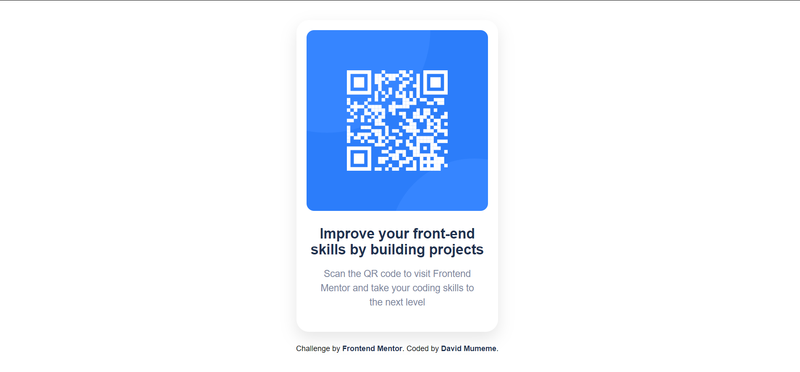
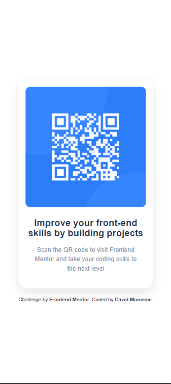

# Frontend Mentor - QR code component solution
This is my solution to the QR Code Component Challenge on Frontend Mentor. This project helped me strengthen my HTML and CSS fundamentals while building a clean and responsive UI.

## Challenges Encountered 

One challenge was making sure the QR code card was properly centered and looked consistent across different screen sizes. I overcame this by experimenting with CSS Flexbox and testing the layout on multiple devices. Another challenge was deploying the site: the project did not display at first because the index.html file was not at the root of the repository. I fixed this by reorganizing the folder structure and ensuring all file paths were correct.

## Screenshot
#  Desktop

###  Mobile

### 🔗 Links
Solution URL: [*/not yet deployed/*]
- Live Site URL: [*/not yet deployed/*]

# Learning Reflection

## My process
Built with
Semantic HTML5 markup
CSS3 (Flexbox, Grid, custom properties)
Mobile-first workflow
Responsive design techniques

## What I Learned
Through this project, I improved my skills in HTML and CSS, especially using Flexbox to center and align elements. I learned how to create a clean, responsive layout that works on both mobile and desktop screens. I also gained experience deploying a project online using GitHub Pages, which taught me how to structure files correctly and manage versions with Git.

## Example code I’m proud of:
'''html
<h1 class="title">
        Improve your front-end skills by building projects
      </h1>

''''CSS

title {
  font-size: 1.4rem;
  font-weight: 700;
  color: hsl(218, 44%, 22%);
  margin-bottom: 15px;
}

## Built With
HTML5
CSS3
Flexbox
Mobile-first workflow

## Improvements for Future Projects
Next time, I would focus on writing cleaner, more maintainable CSS and using semantic HTML tags more effectively. I would also spend more time on subtle design enhancements to make the layout more visually appealing. Additionally, I plan to improve the README documentation to provide clearer instructions and project insights.

## How AI Helped Me
I used **AI assistance ** to:
  
- Improve accessibility by adding proper  attributes and semantic HTML tags  
- Make my CSS cleaner and more maintainable  
- Ensure responsiveness and design fidelity on both mobile and desktop  
- Rewrite my README to be more professional and structured  

Using AI helped me learn faster and avoid common mistakes while still understanding the concepts myself.

## Author

- GitHub: [David-max-tech](https://github.com/David-max-tech)
- Frontend Mentor: [David-max-tech](https://www.frontendmentor.io/profile/David-max-tech)
- Twitter - [@David Mumeme]

## Acknowledgments

- [Michael Burns](https://michaelkentburns.com/) Thanks to Michael Burns for supporting this project.  
- [Salomon mwilo](https://github.com/Salomonmwilo) – mentor who provided valuable feedback and advice.  
- [FreeDev Group my team](https://github.com/FreeDev-Group) – for providing resources, inspiration, and a collaborative environment.  
- [Frontend Mentor](https://www.frontendmentor.io) – for the challenge and design mockups.  
